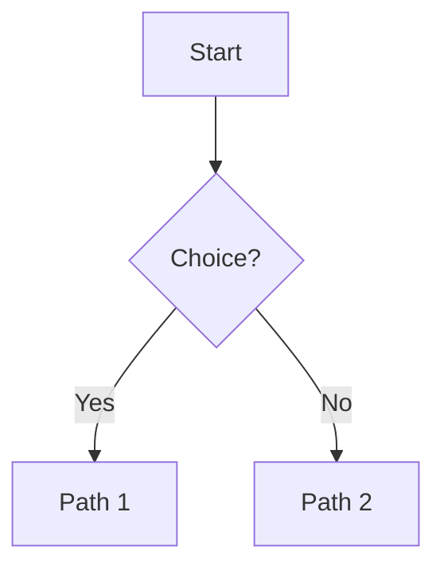
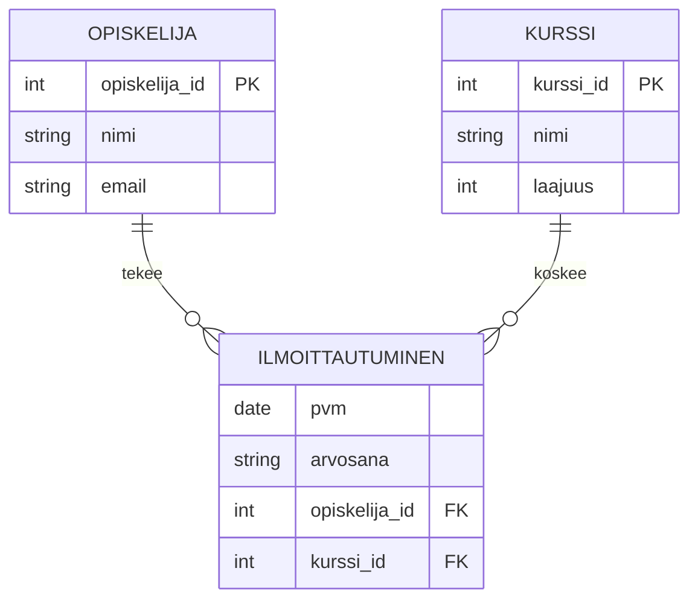
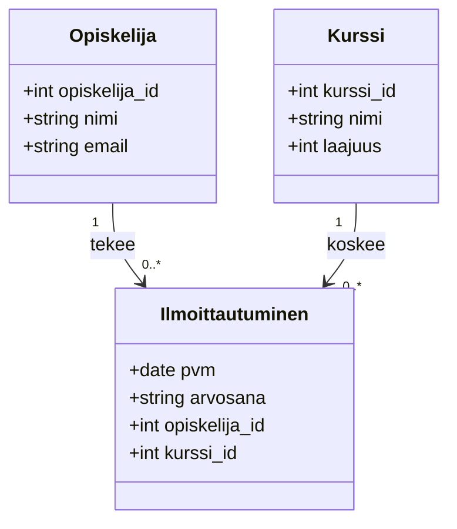

# Diagrams2

## Demo:

```mermaid
graph TD
  A[Start] --> B{Choice?}
  B -- Yes --> C[Path 1]
  B -- No  --> D[Path 2]
```

## Crow's Foot Notaatio:

```mermaid
erDiagram
    OPISKELIJA {
        int opiskelija_id PK
        string nimi
        string email
    }
    KURSSI {
        int kurssi_id PK
        string nimi
        int laajuus
    }
    ILMOITTAUTUMINEN {
        date pvm
        string arvosana
        int opiskelija_id FK
        int kurssi_id FK
    }

    OPISKELIJA ||--o{ ILMOITTAUTUMINEN : tekee
    KURSSI     ||--o{ ILMOITTAUTUMINEN : koskee
```

## UML Notaatio:

```mermaid
classDiagram
class Opiskelija {
  +int opiskelija_id
  +string nimi
  +string email
}
class Kurssi {
  +int kurssi_id
  +string nimi
  +int laajuus
}
class Ilmoittautuminen {
  +date pvm
  +string arvosana
  +int opiskelija_id
  +int kurssi_id
}

Opiskelija "1" --> "0..*" Ilmoittautuminen : tekee
Kurssi     "1" --> "0..*" Ilmoittautuminen : koskee
```
